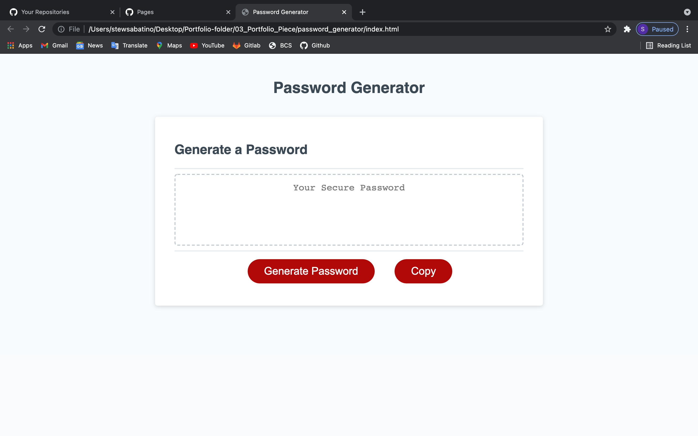

# password_generator
* generates a password for given length and characters
* HTML - https://stewsabatino.github.io/password_generator/
* Snippet - 

## Goals
* When the button is clicked to generate a password a series of prompts pop up asking questions
* The prompts include: the amount of characters wanted, if the user wants lower case, upper case, numbers and special characters
* Define each character in an array
* These answers are saved as variables and used to generate a user specific password at random
* Write the generate password function
* Add a button using HTML and Javascript to copy the password to the users clip board

### Prompts
* Code for the arrays / info gathering / prompts / saving info to a variable -
* Arrays -
```
// creating arrays for each case
var lowerCase = ["a", "b", "c", "d", "e", "f", "g", "h", "i", "k", "l", "m", "n", "o", "p", "q", "r", "s", "t", "u", "v", "w", "y", "x", "z"];
var upperCase = lowerCase.map(letter => letter.toUpperCase());
var numeric = [0, 1, 2, 3, 4, 5, 6, 7, 8, 9];
var specialChar = ["!", "#", "$", "@", "+", "-", "&", "|", "!", "(", ")", "{", "}", "[", "]", "^",
  "~", "*", "?", ":", "\"",];
``` 

* getInfo function
```
function getInfo() {
  // window prompt to choose password length
  var passwordLength = window.prompt("Pick a password length between 8 and 128 characters")
  console.log(passwordLength);
  // if password is less than 8 or more than 128 show alert saying that
  if (passwordLength < 8 || passwordLength > 128) {
    alert("Please choose a password length between 8 and 128 characters");
    return null;
  } else {
    // once password length is answered new prompts come up to ask what characters the user wants
    var lowerCaseIncl = confirm("Would you like to include lowercase?");
    var upperCaseIncl = confirm("Would you like to include uppercase?");
    var numericIncl = confirm("Would you like to include numbers?");
    var specialCharIncl = confirm("Would you like to include a special character?");
    console.log(lowerCaseIncl);
    console.log(upperCaseIncl);
    console.log(numericIncl);
    console.log(specialCharIncl);
    // return an object with key and value pairs
    var answers = { 
      passwordLength,
      lowerCaseIncl,
      upperCaseIncl,
      numericIncl,
      specialCharIncl
    };

    console.log(answers);

    return answers;
  }
}
```

#### Generate password function
```
// define generatePassword
function generatePassword(){
  // var passwordToReturn = "Placeholder"
  var options = getInfo();
  // "if" functions to add the arrays for a boolean value true
  let charCodes = [];
  if (options.lowerCaseIncl) charCodes = charCodes.concat(lowerCase);
  if (options.upperCaseIncl) charCodes = charCodes.concat(upperCase);
  if (options.numericIncl) charCodes = charCodes.concat(numeric);
  if (options.specialCharIncl) charCodes = charCodes.concat(specialChar);
  if (!options.lowerCaseIncl && !options.upperCaseIncl && !options.numericIncl && !options.specialCharIncl) {
     alert("Please choose characters to include in the password")
  }
  console.log(charCodes);
  charCodes.join("");

  console.log(charCodes.length);
  // loop over password length and pick a random character from charCodes string
  var passwordToReturn = "";
  for ( var i = 0; i < options.passwordLength; i++) {
    var characterCode = charCodes[Math.floor(Math.random() * charCodes.length)];
    passwordToReturn += characterCode;
  }
  return passwordToReturn;
}
```

##### Copy button
* HTML -
```
<div class="card-footer">
          <button id="generate" class="btn">Generate Password</button>
          <button id="btn2" class="btn" onclick="copyPassword()">Copy</button>
        </div>
```
* Javascript - 
```
// copy password function
function copyPassword() {
  var copyText = document.getElementById("password");
  copyText.select();
  document.execCommand("copy");
}
```